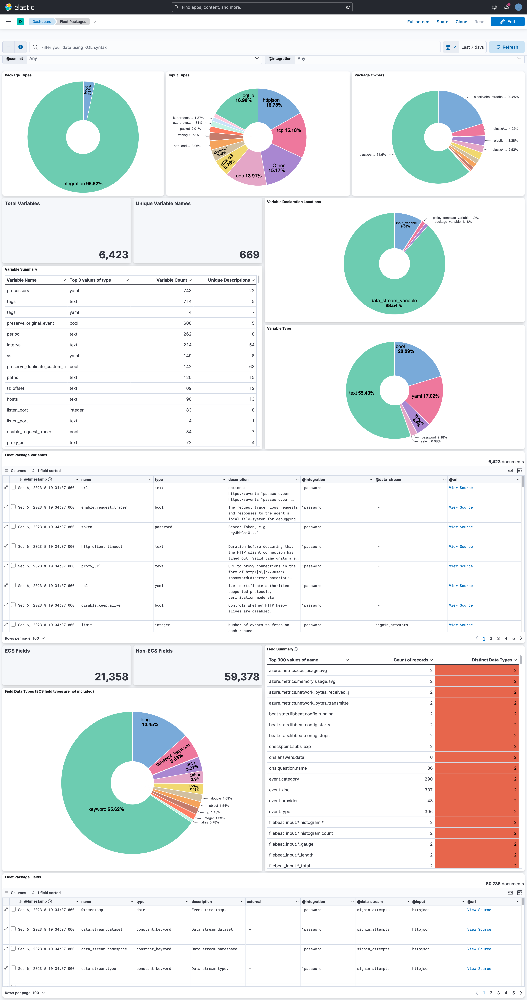
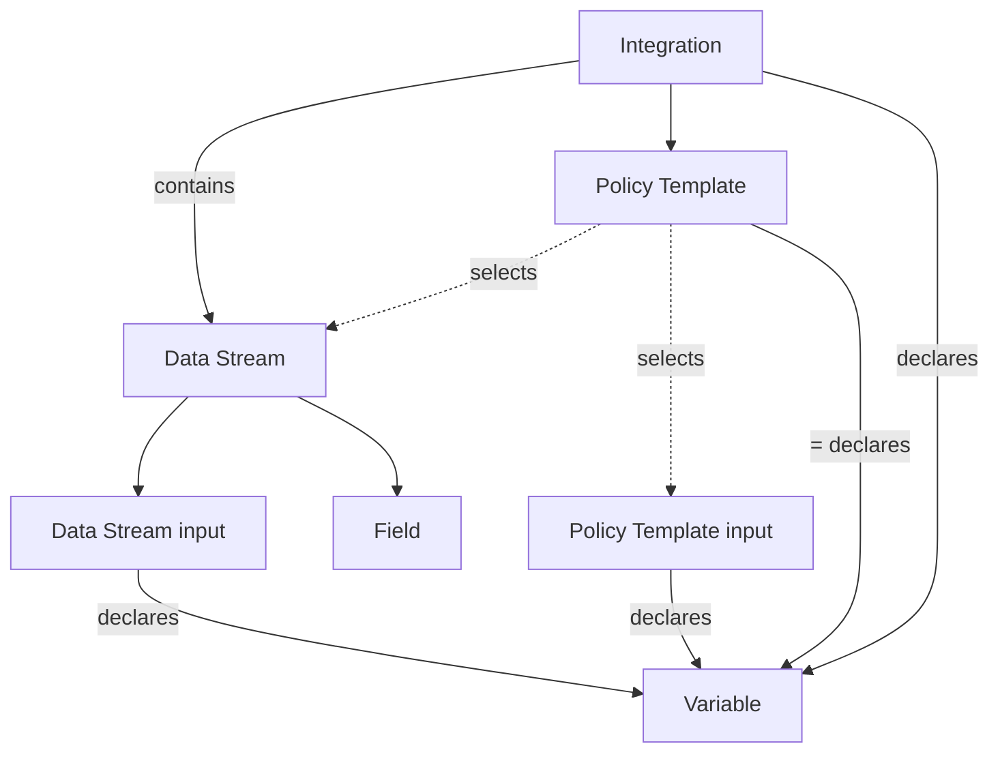

# fleetpkg-indexer

`fleetpkg-indexer` is a tool that reads Fleet package specifications and indexes the information
into Elasticsearch.

You can use the data to answer questions like this and more:

- What ECS fields are declared in a data stream?
  `@type:field and @integration:1password and @data_stream:audit_events`
- Are the fields with the same name but different data types?
- What packages are not deprecated but are "rsa2elk"?
  - `@attributes:"rsa2elk" and not @attributes:"deprecated" and @type:"manifest" and @owner:"elastic/security-external-integrations" `
- What packages are deprecated?
  - `@attributes:"deprecated" and @type:"manifest"`

### Usage Example

You must have a local clone of `elastic/integrations`.

```shell
go run github.com/andrewkroh/go-examples/fleetpkg-indexer@main \
  -packages-dir ~/code/elastic/integrations/packages \
  -es-url "https://localhost:9200" \
  -insecure \
  -u elastic \
  -p changeme
```

### Dashboard

You can load the included dashboard by importing the saved objects into Kibana.



### Data

In addition to the original attributes found in package-spec, some additional
fields are added to the documents to help with pivoting and correlating.

- `@type` - Package data is separated into different documents. They type of data
  is indicated by `@type`. The values for the field are:
    - build_manifest
    - data_stream_manifest
    - data_stream_variable
    - field
    - input_variable
    - manifest
    - package_variable
    - policy_template
    - policy_template_variable
    - sample_event
    - variable
- `@integration` - Associated integration name.
- `@data_stream` - Associated data stream name.
- `@policy_template` - Associated policy template name.
- `@commit` - elastic/integration git commit ID
- `@timestamp` - Timestamp of the git commit.
- `@url` - URL pointing to source file in GitHub.
- `@input` - Associated input types.
- `@attributes` - Contains tags like `deprecated` or `rsa2elk`.

### Known issues

- Annotation with the related `@policy_template` is not fully implemented.
- Fields related to input type packages are not indexed.

### Integration Package Component Relationships

- An integration contains one or more policy templates.
- Each policy template is displayed as a card in the Fleet integration UI.
- A policy template selects combinations of data streams and input types.
- The intersection of the "allowed" inputs from the policy template and the
available inputs in the "allowed" data streams from the policy template
determines what inputs can be configured.
- There are four places where variables can be declared.
- Fields are specified per data stream.


