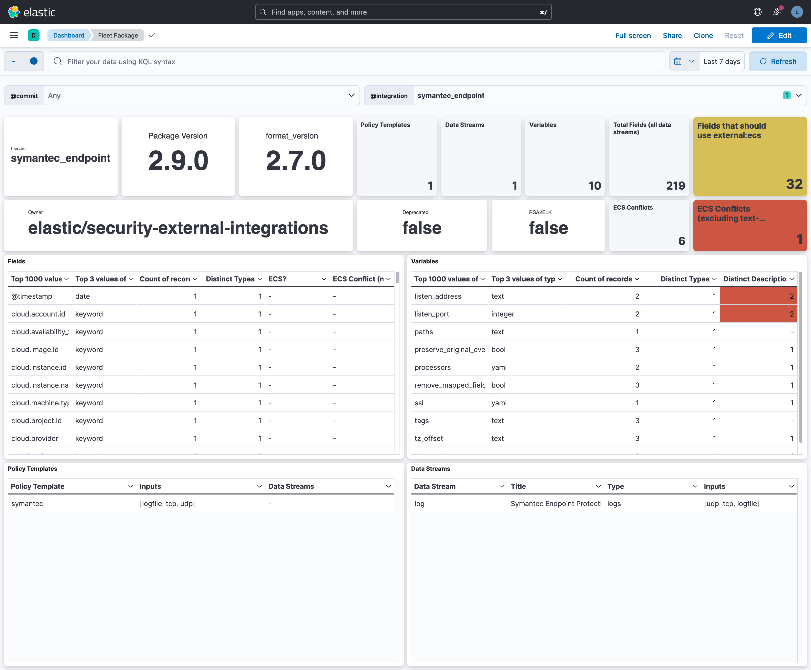

# fleetpkg-indexer

`fleetpkg-indexer` is a tool that reads Fleet package specifications and indexes the information
into Elasticsearch.

You can use the data to answer questions like this and more:

- What ECS fields are declared in a data stream?
  - `@type:field and @integration:1password and @data_stream:audit_events`
- Are there fields with the same name but different data types?
- What packages are not deprecated but are "rsa2elk"?
  - `@attributes.rsa2elk:true and @attributes.deprecated:false and @type:"manifest" and @owner:"elastic/security-external-integrations"`
- What packages are deprecated?
  - `@attributes.deprecated:true and @type:"manifest"`
- What `external: ecs` fields are invalid uses of ECS?
  - `@type:field and @extra.ecs_field_not_found:true`
- Show me all field definitions that conflict with ECS data types, but exclude
  text-family conflicts (e.g text vs match_only_text).
  - `@type:field and @extra.ecs_data_type_conflict:true and @extra.ecs_text_family_conflict:false`
- What pipelines append to the `event.kind` field, but do not set allow_duplicates to false?
  - `@type:"ingest_processor" and processor.append.field:"event.kind" and (processor.append.allow_duplicates:true or not processor.append.allow_duplicates:*)`

### Usage Example

Install dashboards (do this once).

```shell
go run github.com/andrewkroh/go-examples/fleetpkg-indexer@main \
  -dashboard \
  -kibana-url "https://localhost:5601" \
  -insecure \
  -u elastic \
  -p changeme
```

Index the data. You must have a local clone of `elastic/integrations`.

```shell
go run github.com/andrewkroh/go-examples/fleetpkg-indexer@main \
  -packages-dir ~/code/elastic/integrations/packages \
  -es-url "https://localhost:9200" \
  -insecure \
  -u elastic \
  -p changeme
```

### Dashboards

You can load the included dashboards by running the aforementioned command or
by manually importing the saved objects through the Kibana UI.


Single Package View



### Data

In addition to the original attributes found in package-spec, some additional
fields are added to the documents to help with pivoting and correlating.

- `@type` - Package data is separated into different documents. They type of data
  is indicated by `@type`. The values for the field are:
    - build_manifest
    - data_stream_manifest
    - data_stream_variable
    - field
    - ingest_pipeline
    - input_variable
    - manifest
    - package_variable
    - policy_template
    - policy_template_variable
    - sample_event
    - variable
- `@integration` - Associated integration name.
- `@data_stream` - Associated data stream name.
- `@policy_template` - Associated policy template name.
- `@commit` - elastic/integration git commit ID
- `@timestamp` - Timestamp of the git commit.
- `@url` - URL pointing to source file in GitHub.
- `@input` - Associated input types.
- `@attributes.deprecated` - Is the package deprecated? Determine via the `description`.
- `@attributes.rsa2elk` - Is this package generated through the [rsa2elk project](https://github.com/adriansr/nwdevice2filebeat)?
- `@extra.*` - Extra insights into the document that are generated by this tool.
- `pipeline` - The name of the pipeline file that the document is associated with.
- `processor_type` - The type of the processor that the document is associated with.
- `processor_path` - The JSONPath to the processor within the pipeline file.
- `processor` - The processor definition stored in a `flattened` field.

### Known issues

- Fields related to input type packages are not indexed.

### Integration Package Component Relationships

The structure of packages is complicated because of the relationships
between policy templates, data streams, and inputs.

- An integration contains one or more policy templates.
- Each policy template is displayed as a card in the Fleet integration UI.
- A policy template selects combinations of data streams and input types.
- The intersection of the "allowed" inputs from the policy template and the
available inputs in the "allowed" data streams from the policy template
determines what inputs can be configured.
- There are four places where variables can be declared.
- Fields are specified per data stream.


