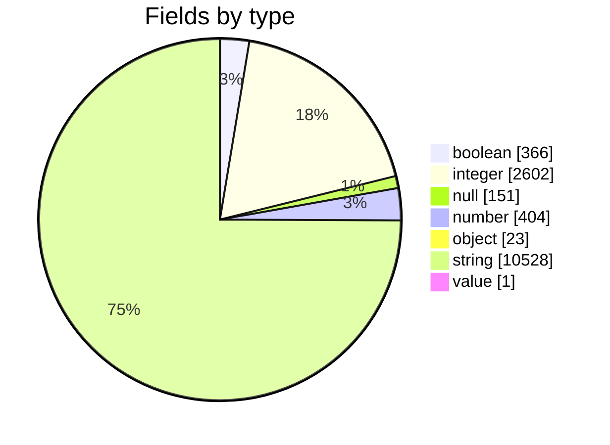

# OCSF 1.3

This is analysis of the field counts in the [Open Cybersecurity Schema Framework](https://schema.ocsf.io/1.3.0/classes?extensions=linux,win).

## All Fields (using depth 0)

total count = 
14074

(`null` is where traversal ended due to circular references.)

## Field count by class (using depth 0)
|key                          |value |
|---                          |----- |
|account_change               |2576  |
|admin_group_query            |2167  |
|api_activity                 |2673  |
|application_lifecycle        |2115  |
|authentication               |3549  |
|authorize_session            |2853  |
|base_event                   |1324  |
|compliance_finding           |2581  |
|config_state                 |2160  |
|data_security_finding        |3826  |
|datastore_activity           |3089  |
|detection_finding            |6491  |
|device_config_state_change   |2099  |
|dhcp_activity                |4035  |
|dns_activity                 |4042  |
|email_activity               |2887  |
|email_file_activity          |2533  |
|email_url_activity           |2201  |
|entity_management            |3092  |
|event_log                    |3194  |
|file_activity                |2880  |
|file_hosting                 |3253  |
|file_query                   |2441  |
|file_remediation_activity    |2507  |
|folder_query                 |2441  |
|ftp_activity                 |4372  |
|group_management             |2621  |
|http_activity                |4407  |
|incident_finding             |1499  |
|inventory_info               |2089  |
|job_query                    |2515  |
|kernel_activity              |2195  |
|kernel_extension             |2532  |
|kernel_object_query          |2104  |
|memory_activity              |2656  |
|module_activity              |2538  |
|module_query                 |2910  |
|network_activity             |4034  |
|network_connection_query     |2588  |
|network_file_activity        |4368  |
|network_remediation_activity |2189  |
|networks_query               |2107  |
|ntp_activity                 |4029  |
|patch_state                  |2149  |
|peripheral_device_query      |2104  |
|process_activity             |3006  |
|process_query                |2561  |
|process_remediation_activity |2627  |
|rdp_activity                 |4416  |
|remediation_activity         |2164  |
|scan_activity                |2116  |
|scheduled_job_activity       |2606  |
|security_finding             |2988  |
|service_query                |2102  |
|session_query                |2113  |
|smb_activity                 |4404  |
|software_info                |2129  |
|ssh_activity                 |4377  |
|tunnel_activity              |4113  |
|user_access                  |2615  |
|user_inventory               |1945  |
|user_query                   |2161  |
|vulnerability_finding        |3149  |
|web_resource_access_activity |2934  |
|web_resources_activity       |3220  |
|win/prefetch_query           |2102  |
|win/registry_key_activity    |2202  |
|win/registry_key_query       |2103  |
|win/registry_value_activity  |2207  |
|win/registry_value_query     |2107  |
|win/resource_activity        |2212  |
|win/win_service_activity     |2205  |

## Field count by class (using depth 1)
|key                          |value |
|---                          |----- |
|account_change               |4628  |
|admin_group_query            |3807  |
|api_activity                 |4951  |
|application_lifecycle        |3693  |
|authentication               |7033  |
|authorize_session            |5193  |
|base_event                   |1696  |
|compliance_finding           |4297  |
|config_state                 |3738  |
|data_security_finding        |6676  |
|datastore_activity           |5553  |
|detection_finding            |12311 |
|device_config_state_change   |3677  |
|dhcp_activity                |7589  |
|dns_activity                 |7596  |
|email_activity               |5165  |
|email_file_activity          |4359  |
|email_url_activity           |3779  |
|entity_management            |5268  |
|event_log                    |5720  |
|file_activity                |4954  |
|file_hosting                 |5965  |
|file_query                   |4267  |
|file_remediation_activity    |4333  |
|folder_query                 |4267  |
|ftp_activity                 |8174  |
|group_management             |4673  |
|http_activity                |8209  |
|incident_finding             |1947  |
|inventory_info               |3667  |
|job_query                    |4403  |
|kernel_activity              |3773  |
|kernel_extension             |4358  |
|kernel_object_query          |3682  |
|memory_activity              |5316  |
|module_activity              |4364  |
|module_query                 |5818  |
|network_activity             |7588  |
|network_connection_query     |5248  |
|network_file_activity        |8170  |
|network_remediation_activity |3767  |
|networks_query               |3685  |
|ntp_activity                 |7583  |
|patch_state                  |3727  |
|peripheral_device_query      |3682  |
|process_activity             |5914  |
|process_query                |5221  |
|process_remediation_activity |5287  |
|rdp_activity                 |8218  |
|remediation_activity         |3742  |
|scan_activity                |3694  |
|scheduled_job_activity       |4494  |
|security_finding             |4821  |
|service_query                |3680  |
|session_query                |3691  |
|smb_activity                 |8206  |
|software_info                |3707  |
|ssh_activity                 |8179  |
|tunnel_activity              |7729  |
|user_access                  |4667  |
|user_inventory               |3523  |
|user_query                   |3801  |
|vulnerability_finding        |5175  |
|web_resource_access_activity |5438  |
|web_resources_activity       |5786  |
|win/prefetch_query           |3680  |
|win/registry_key_activity    |3780  |
|win/registry_key_query       |3681  |
|win/registry_value_activity  |3785  |
|win/registry_value_query     |3685  |
|win/resource_activity        |3790  |
|win/win_service_activity     |3783  |
