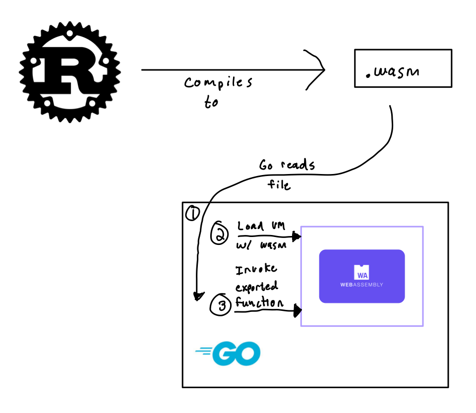

# WebAssembly Runtime Example

This example executes a Rust program compiled to WebAssembly (`sample.wasm`)
inside of a Go binary. The Go binary uses a pure Go implementation of a
WebAssembly VM (https://github.com/perlin-network/life).

To execute:

`go run wasm.go`
